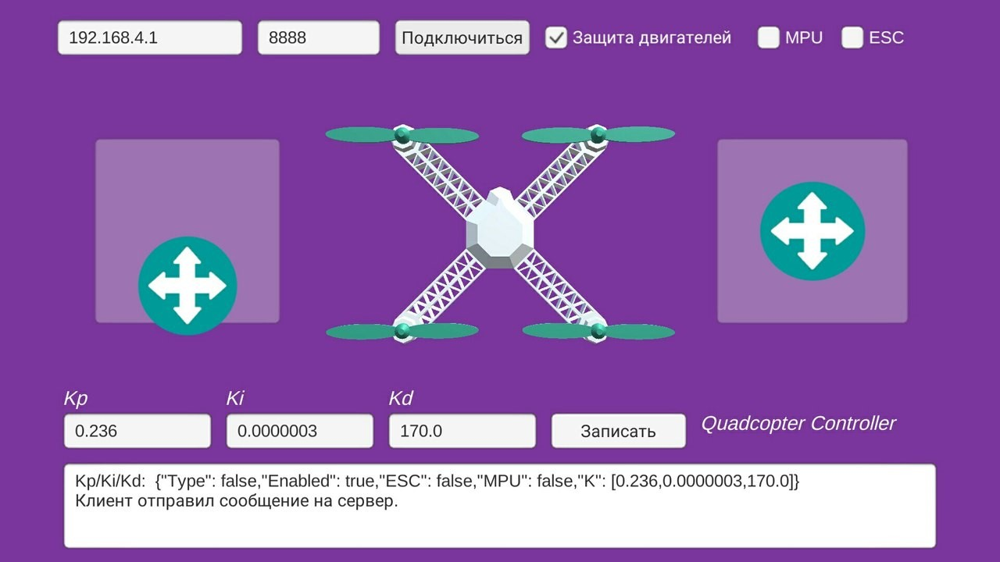
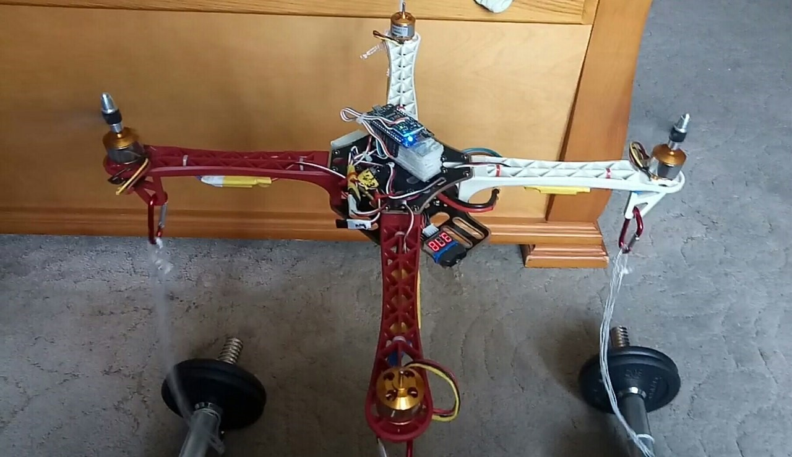
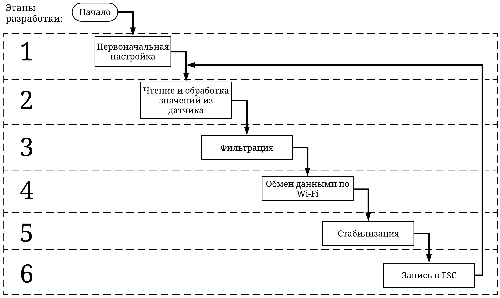
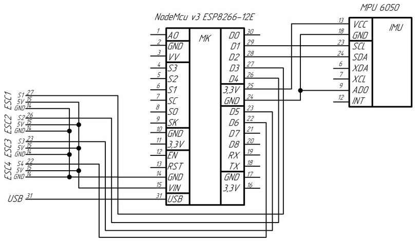
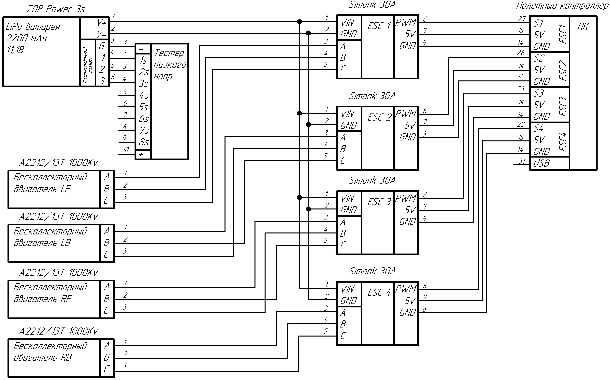

# Quadcopter Controller ESP8266

My bachelor work from RTU MIREA.

This project is dedicated to creating of full-work quadcopter flight controller with android based remote controller.

Flight controller developed in Arduino IDE for NodeMCU v3 ESP8266.

Remote controller developed in Unity3d with Android SDK.

## Remote controller interface

## Cuadcopter Testing Photos

## Cascade model

## Flight controller scheme

## Quadcopter wiring scheme

